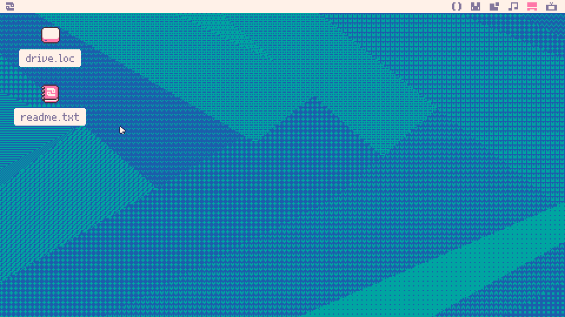

# Part 0: Setting up

To start, you'll need to have a copy of Picotron, which is available from [the Lexaloffle website](https://www.lexaloffle.com/picotron.php). Run the installer if on Windows, or download and extract the zip for Windows/Mac/Linux. Then run the executable.  You'll be dropped into the Picotron desktop:

[The manual for Picotron is available here](https://www.lexaloffle.com/dl/docs/picotron_manual.html). Picotron is separated into multiple workspaces for all of its tools. You can navigate between them using Alt+Left/Right.  The workspaces are (from left to right): Code Editor, Sprite Editor, Map Editor, SFX/Music Editor, Desktop, Terminal

This is all you need to make the whole game, no need to download any other tools, libraries, or resources. I'll be stepping through all the things you need at a reasonable pace, so you don't need to worry too much. [Let's continue in Part 1](../part-1/part-1.html)!
