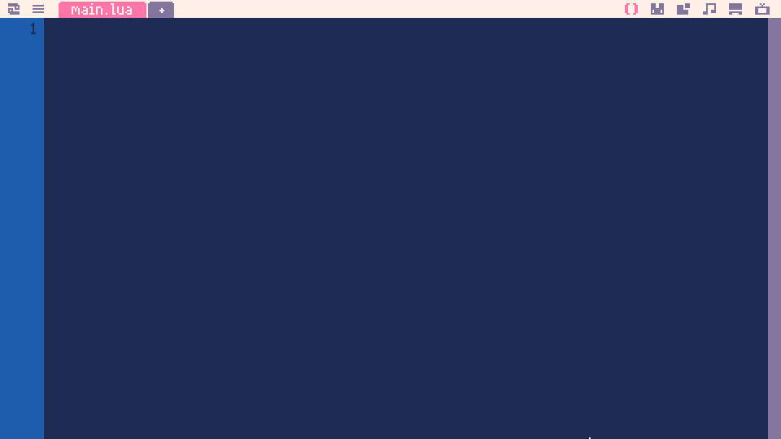
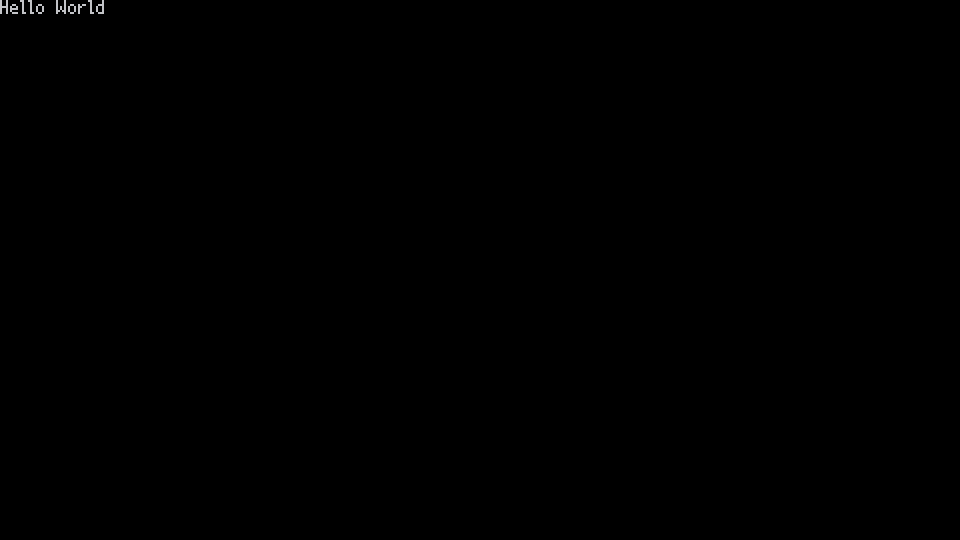
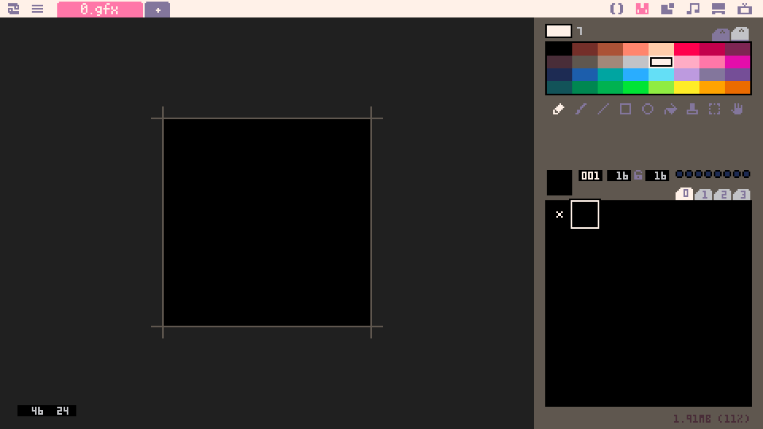
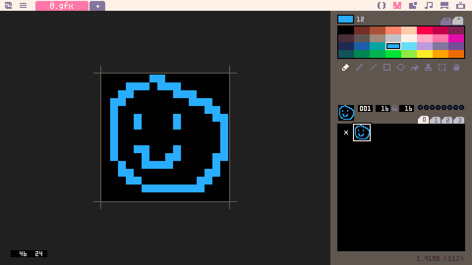

# Part 1: Drawing the player and moving it around

This part assumes [you've read Part 0](../part-0/part-0.html) and are at the Picotron desktop. Press Alt+Right twice to get to the code editor to begin:



Picotron does start with an empty project resident in memory, and this is what we're looking at right now.  We'll go over the basics of saving at the end of this part, and we'll reload it in Part 2.

Since Picotron is a game development application, the code it's expecting is tailored to the game event loop. There are three basic functions every Picotron program needs:
- `_init()`:  This is the initialization function that will run at the start of your game.  This should be used for setting up anything your game needs.
- `_update()`: This is the update function. This is where all of your game logic would reside. It gets called 60 times per second.
- `_draw()`: This is the draw function. This is where all of your code to put things on the screen will live. This generally gets called 60 times per second, but the window manager might slow that down to 30 or 20 times per second if your game is using too much CPU.
We're going to add these functions to `main.lua`. In Lua, functions are preceded by the word 'function', and end with the word 'end', so the basic structure of the file will look like this:

```lua
function _init()
end

function _update()
end

function _draw()
end
```

You could run this right now, but you'd just get a black screen since we're not drawing anything in our `_draw()` function. So let's add something to simply put some text on the screen by replacing the `_draw()` function with the following:

```lua
function _draw()
	cls()
	print('Hello World')
end
```

Press Ctrl+R to run your program.  You should see 'Hello World' displayed in white on a black screen, like this screenshot:



Press Esc twice to exit back to your code editor. Congrats on running your first Picotron program! Let's go over what we've just added;

What you see here are your first Picotron API calls. `cls()` clears the screen, which you're going to want to do at the beginning of your `draw()` function. `print()` is a function that allows you to draw text to the screen. This function can take multiple parameters. Right now, we're only giving it one parameter, the string 'Hello World'. It will draw that string at the internal cursor position (which we will get into in a later part). We can also specify the coordinates to draw it as well as the color to draw it with, so let's try that now:
```lua
function _draw()
	cls()
	print('Hello World', 150, 100, 8)
end
```

Again, press Ctrl+R to run:


And press Esc twice to return to your code editor again.

This is fun and useful, but what you really want is to make a character and have it move around your screen! Let's get to that now. First, press Alt+Left once to move to the sprite editor:



That looks complicated, doesn't it.  For right now, we're not going to do too much with this, we just want to make an image we can use for our player. Pick a color and doodle a little bit in the 16x16 pixel grid on the left, like so:



Wow, my art skills are not great.  Hopefully your doodle came out a little better. Either way, lets get this little guy on the screen! Press Alt+Right to go back to your code editor. We'll modify our `_draw()` function to remove the `print()` and replace it with a new API command called `spr()`.

```lua
function _draw()
	cls()
	spr(1, 150, 100)
end
```


Well hey, look at that, it came out just like I wanted it to! What's next? Moving our little guy around, of course! To do that we're going to need to add a few things. Since our character's position will be changing, we'll modify our code to read the position from a variable instead of hardcoding it:

```lua
function _init()
	player_x = 150
	player_y = 100
end

function _update()
end

function _draw()
	cls()
	spr(1, player_x, player_y)
end
```

That change isn't going to do anything if you run it again, but it's necessary for the next part: input!

```lua
function _update()
	if btnp(0) then
		player_x -= 16
	elseif btnp(1) then
		player_x += 16
	elseif btnp(2) then
		player_y -= 16
	elseif btnp(3) then
		player_y += 16
	end
end
```

`btnp()` is another Picotron API call, this time accepting input from a controller or keyboard. The number in the function tells Picotron which button we're asking about, in this case, 0, 1, 2, and 3 are Left, Right, Up, and Down respectively. We've added or subtracted 16 pixels from the player's position to represent grid movement in each of these directions (Picotron treats the top left corner of the screen as x=0, y=0). If you run your program now, you can control your character with the arrow keys:


Success! But before we take a break, let's talk about two important topics: saving and exporting. Right now, your game is in Picotron's memory, but it hasn't been written out to the file system for safekeeping. If you close Picotron now, it will all disappear, and you'll have to start this whole thing over. We don't want that! Press Alt+Left once to get over to our Picotron terminal, and type the following:

```
cd /
save roguelike
```

The first part (`cd /`) is to make sure that we're not inside `/ram/cart` which is where Picotron holds your game in its memory.  You can't save the game inside memory, and it would yell at you if you tried. So, we're moving to /, which is the root of the filesystem.  Feel free to make a folder for your work if you want (`mkdir directory_name` and then `cd directory_name`), but you don't have to. The second line (`save roguelike`) saves the game as 'roguelike'. It'll create a file on the Picotron filesystem called roguelike.p64, and everything you do will be inside that file, from your code to your cool little doodle of your character. If you want to double-check, you can type `ls` to show the contents of the current directory you're in, and you should see roguelike.p64 in there

But what if we want to share our awesome game with the world? Picotron has another terminal command for that:
```
export roguelike.html
```

Then, you can go back over to your desktop (Alt+Left) and open up the drive by double-clicking on 'drive.loc'. Find 'roguelike.html' in there, right-click and select 'View in Host OS'. A web browser should pop up on your computer with a black screen and a little play icon. Click that play icon, and Picotron will boot into your game, right in the browser! You can move your little dude around to your heart's content, and you can take that HTML file (the path to which you should be able to see in your browser) and share that on whatever web hosting thing you like. [Check out mine here!](./p1-roguelike.html). According to the Picotron roadmap, binary exports will be available once it reaches v0.2, but right now all we have are HTML files.

Whew, we did a lot of work today. Maybe it's time to take a break. [Or maybe it's time to move to Part 2](../part-2/part-2.html)? Your call!
