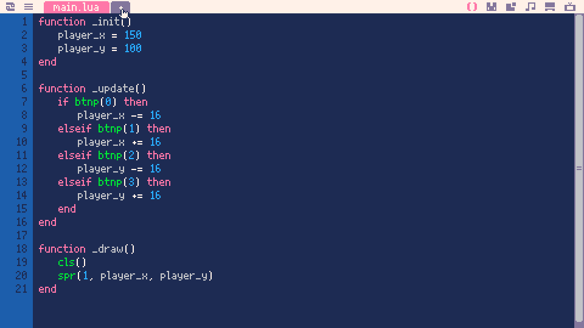
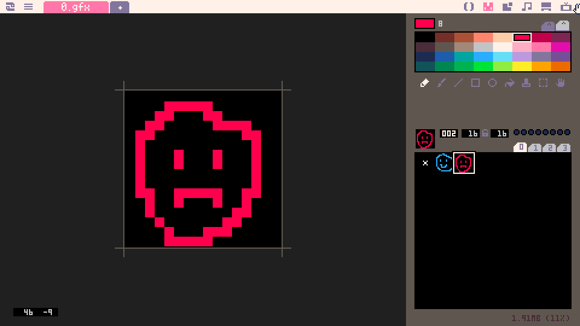
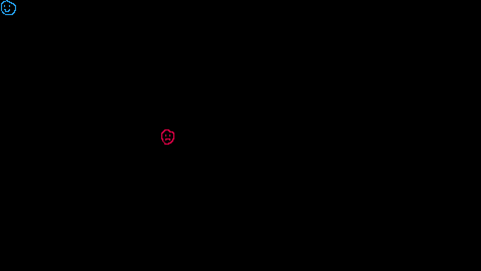
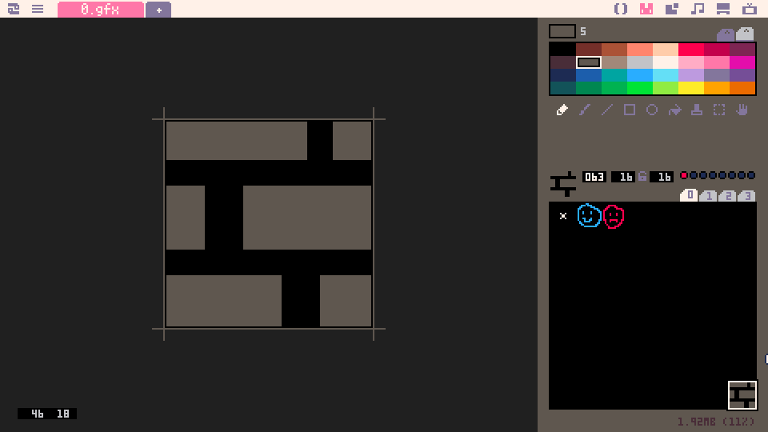
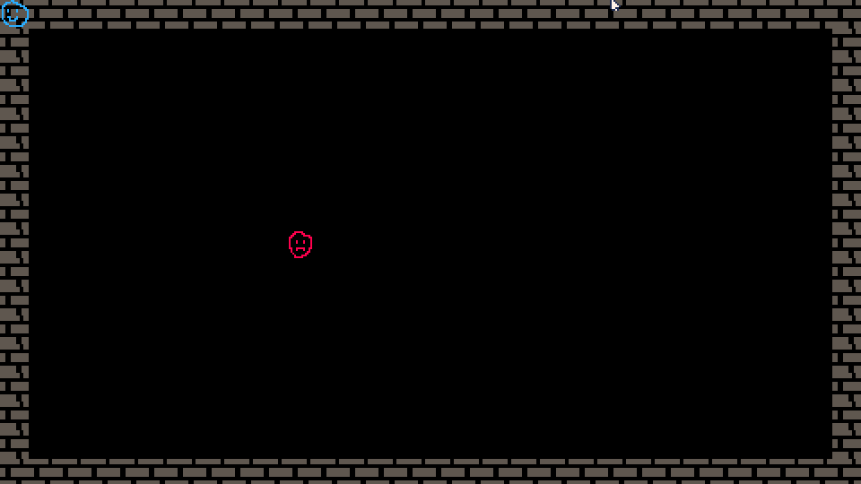
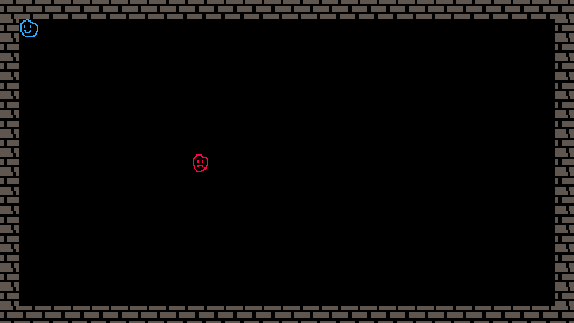

# Part 2: Generic entities and the map

Well, we've got something going in [Part 1](../part-1/part-1.html), but if we want our future award-winning roguelike to be understandable when working on it in the future, we need to start laying the groundwork now. To start off, we need to group information about the player (and future enemies!) together into an object. Let's start by making a new file to keep this stuff in. In your code editor, click the 'New Tab' button, which is a tab with a + at the end of your tab list, which should only have 'main.lua' at this point.



This will bring up a dialog where you can create a new file. Let's call it 'entities.lua'. In this file, let's start making a new framework for our entities. Lua isn't really made for classes, but we can sort of fake it using tables, the main data structure that Lua gives us.

```lua
-- entities.lua

Entity = {}
Entity.__index = Entity

-- constructor for generic entity
function Entity:new(x, y, sprite)
	local o = setmetatable(o, self)
	o.x = x
	o.y = y
	o.sprite = sprite
	return o
end

-- generic move function for entity
function Entity:move(dx, dy)
	self.x += dx
	self.y += dy
end

-- generic draw function for entity
function Entity:draw()
	spr(self.sprite, self.x, self.y)
end
```

That's a lot.  Basically what you're doing is creating a table called Entity, adding a bunch of functions that act on it, and returning a new copy of it when you call `Entity:new()`. We're going to be using these functions to handle our movement and drawing for all entities. With this in hand, let's go back to main.lua and modify it to work with our new Entity class

```lua
-- main.lua

include "entities.lua"

function _init()
	entities = {}
	player = Entity:new(0, 0, 1)
	add(entities, player)
	npc = Entity:new(0, 0, 2)
	add(entities, npc)
end

function _update()
	if btnp(0) then
		player:move(-16, 0)
	elseif btnp(1) then
		player:move(16, 0)
	elseif btnp(2) then
		player:move(0, -16)
	elseif btnp(3) then
		player:move(0, 16)
	end
end

function _draw()
	cls()
	for entity in all(entities) do
		entity:draw()
	end
end
```

Walking through these new changes, the first you can see is the `include` statement. This tells Picotron that you want to take the code from 'entities.lua' and put it in the code that it's executing. That gives us access to our super useful Entity class. In `_init()`, we've removed the x and y variables that were specific to the player, and created an entities table, populating it with the player and an npc. In `_update()` we're replacing all the manual adding positions with the generic move function from Entity. Similarly, in `_draw()`, we've replaced our manual player sprite call with a for loop iterating over all the entities and calling their generic draw function. Since we don't have an npc sprite, go ahead and pop over to the sprite editor and doodle something in slot 2, right next to your player.



Now that we've got that all sorted, let's run our game!



Looking pretty good! What more could you possibly want in a game? It's got action, drama, beautiful art, and compelling characters! What? Oh, all that other stuff? Ok, fine. Let's add some walls. Can't have a game without walls. Pop back over to your sprite editor, and let's make a wall tile.



I've added my wall tile way down at the bottom because I like to separate things out a bit, but feel free to put it wherever your heart leads you. just make sure you know what sprite slot you're putting it in. Mine is in 63, so that's what we'll be using. One extra thing: Do you see that little red dot right there next to the 16x16? That's a flag. Click that little button there to make sure that's on. We're going to need that later. Now, head back over to your code editor, we've got a lot of work to do. Make a new file called 'mapgen.lua', and add the following:

```lua
-- mapgen.lua
width = 29 -- how many tiles tall and wide the screen is
height = 16

floor = 0 -- sprite index for the floor (empty tile)
wall = 63 -- sprite index for our wall tile

-- super simple room creation
function populateMap()
	for y = 0, height do
		for x = 0, width do
			tile = floor
			if x == 0 or x == width then
				tile = wall
			elseif y == 0 or y == height then
				tile = wall
			end
			mset(x, y, tile)
		end
	end
end
```

Here we're creating a real basic map, essentially just walls around the edge of the screen. Not anything fancy, but it's a start. You'll notice another Picotron API call you're unfamiliar with: `mset`. Picotron has the concept of a tile map built in, so we can specify tile positions on the grid and let it know what sprite we want to fill it in with. Now that we have that, we need to use it in our game. Head back to 'main.lua'.

```lua
-- main.lua

include "entities.lua"
include "mapgen.lua"

function _init()
	populateMap()
	entities = {}
	player = Entity:new(0, 0, 1)
	add(entities, player)
	npc = Entity:new(160, 128, 2)
	add(entities, npc)
end

.... -- we're skipping _update() because nothing is changing there

function _draw()
	cls()
	map()
	for entity in all(entities) do
		entity:draw()
	end
end
```

Just a couple changes here:
- We're including 'mapgen.lua' a tthe top of the file. This brings the code from mapgen.lua into our file to be used.
- We're calling `populateMap()` in `_init()`, which lets us set up the map tiles at the start of the game.
- We're calling another new API function `map()` in `_draw()`. This tells picotron to draw all of the tiles that we've set in our map. Simple!
If we run our game now, we get something that looks like this:



Well, we succeeded in making our walls, but I think I see something wrong with our player. Also, if you move around a bit, you might notice that you can walk through these walls. Come on wall, keeping people from walking through you is basically your whole job! Let's fix both of these things now. Create a new file called 'utilities.lua'. We're going to use this for helper logic functions.

```lua
-- utilities.lua

function isWalkable(x, y)
	local t = mget(x, y)
	return not fget(t, 0)
end
```
 This one is pretty straightforward, but you're getting introduced to two important API calls. `mget()` lets us get the sprite number of a map tile at a certain x, y coordinate. `fget()` lets us specify a sprite number and get either all of its flags, or as we see here, we can specify a single flag to ask about. We're asking about flag 0, which was that little red dot we set in the sprite editor. Since only walls have that flag set, we can rely on that to let us know whether a tile is walkable or not (but we have to invert it to get the result we want). All this shifting between pixels and tile position is a little tedious though, so let's modify our entity to store tile position instead of pixel coordinates. It's super simple! Go to entities.lua and modify it to look like the following:
 
 ```lua
 -- entities.lua
 ...

function Entity:move(dx. dy)
	local destX = self.x + dx
	local destY = self.y + dy
	if isWalkable(destX, destY) then
		self.x = destX
		self.y = destY
	end
end

function Entity:draw()
	spr(self.sprite, self.x * 16, self.y * 16)
end
```

That's really all it needed! There's two things we've done. First, we've changed the `Entity:move` function to call off to our new `isWalkable` function before we do anything to check to see if our destination is a place we can actually go. Then, we modified `Entity:draw` to multiply x and y by 16, so we can stop using pixels when specifying our entity locations. Now, let's head back to main.lua and finish it all up.

```lua
-- main.lua
include "utilities.lua"
include "entities.lua"
include "mapgen.lua"

function _init()
	populateMap()
	entities = {}
	player = Entity:new(1, 1, 1)
	add(entities, player)
	npc = Entity:new(10, 8, 2)
	add(entities, npc)
end

function _update()
	if btnp(0) then
		player:move(-1, 0)
	elseif btnp(1) then
		player:move(1, 0)
	elseif btnp(2) then
		player:move(0, -1)
	elseif btnp(3) then
		player:move(0, 1)
	end
end

...

-- we're omitting _draw(), because there are no changes needed right now
```

We've added an include statement for utilities.lua way up at the top, and we've changed how we specify entity position and movement. Looks a lot more understandable than pixels, if you ask me. Run your game and marvel at your inability to walk through walls!



So cool. I think it's time for another break. [I'll see you later for Part 3!](../part-3/part-3.html)
