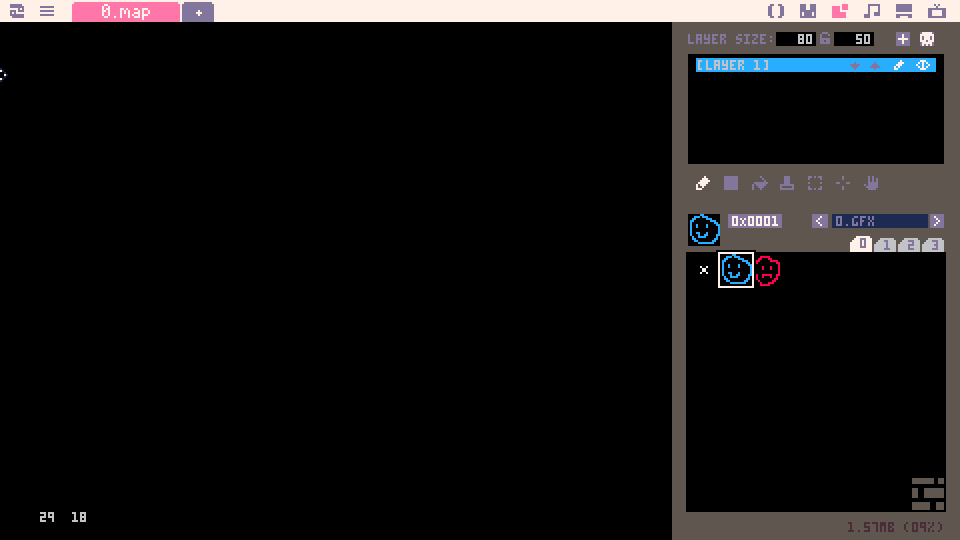
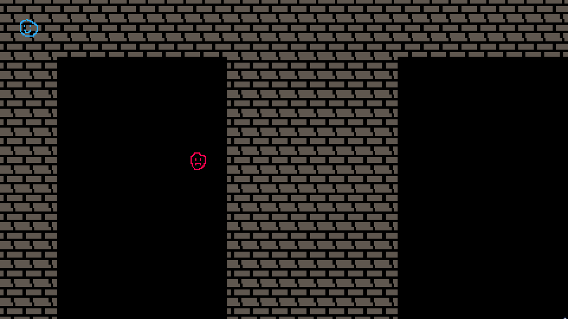
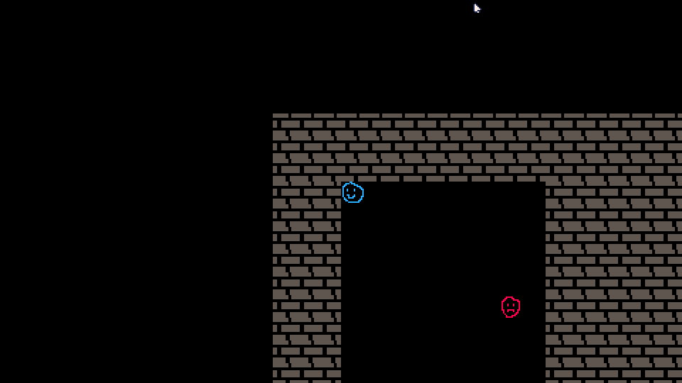
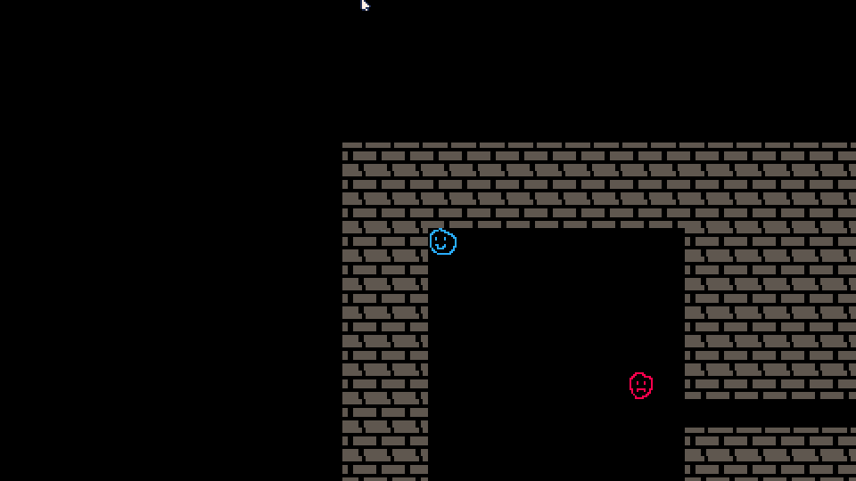
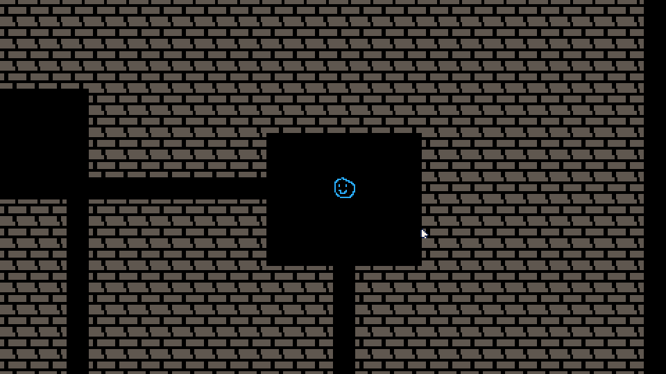

# Part 3: Dungeon Generation

Ok, so, in Part 2 we made a room that's the size of our screen. That's not super interesting though, is it? You want to have a bunch of rooms and walk through them! To achieve that, we're going to scrap most of our current 'map generation' logic, and we're going to start carving rooms out of rock, like real dungeons. This is going to be a long one, so buckle up. Let's pop over to mapgen.lua and make a lot of changes:

```lua
-- mapgen.lua
width = 80
height = 50

floor = 0
wall = 63

RectRoom = {}
RectRoom.__index = RectRoom

-- constructor for RectRoom
function RectRoom:new(x, y, width, height)
	local o = setmetatable({}, RectRoom)
	o.x1 = x
	o.y1 = y
	o.x2 = x + width
	o.y2 = y + height
	return o
end

-- check to see if coordinates are inside the room
function RectRoom:inRoom(x, y)
	local inside = false
	if x >= self.x1 + 1 and x < self.x2 then
		if y >= self.y1 + 1 and y < self.y2 then
			inside = true
		end
	end
	return inside
end

-- creating our map, now with rooms!
function populateMap()
	local rooms = {
		RectRoom:new(2, 2, 10, 15),
		RectRoom:new(20, 2, 10, 15),
	}
	for y = 0, height do
		for x = 0, width do
			local tile = wall
			for room in all(rooms) do
				if room:inRoom(x, y) then
					tile = floor
				end
			end
			mset(x, y, tile)
		end
	end
end
```

Whew, that's a lot. So what are we doing here? 
- We changed the width and height of our dungeon to give us more space to work with.
- We made a rectangular room object called `RectRoom`, that'll represent placing rectangular rooms in our map. This also has a helper function in it to let us check to see if a tile is inside a room.
- We changed the `populateMap` function to put some rooms down, treat all map tiles as wall, and then as we set the tiles in Picotron's map, go through and check to see if a given tile is in our rooms, so we can see if we need to make it floor.
In addition, we'll need to go into the map editor and set the layer size to the width and height we decided in code:


When we run our game, it comes out looking like this:



Well, that's not right. Obviously, the culprit is that first bullet point. We made our map bigger than our screen area! We're going to have to change how we display our screen to get around this. Let's head over to our `_draw()` function in main.lua, the central hub of putting things on the screen.

```lua
-- main.lua

...

function _init()
	populateMap()
	entities = {}
	player = Entity:new(3, 3, 1)
	add(entities, player)
	npc = Entity:new(10, 8, 2)
	add(entities, npc)
end

...

function _draw()
	cls()
	camera(player.x * 16 - (15 * 16), player.y * 16 - (8 * 16))
	map()
	for entity in all(entities) do
		entity:draw()
	end
end
```

First, we change where the player is created at, to keep him out of those pesky walls. Then there's another one of Picotron's API calls, `camera`. It lets us specify where to start drawing the screen from.  We do a little bit of math with the player's position and presto!



Hooray! Well, that was fun, but we should really get back to making our dungeon. We don't have any way to get to that other room! Back in mapgen.lua, let's get to tunneling.

```lua
-- mapgen.lua

...

function RectRoom:center()
	local center = {
		x = self.x1 + flr(self.width / 2),
		y = self.y1 + flr(self.width / 2),
	}
end

-- tunnel between two rooms
function tunnelBetween(room1, room2)
	-- set the start point at the center of the first room
	local current = room1:center()
	-- set the end point at the center of the second room
	local finish = room2:center()

	-- randoml pick if we're going horizontal or vertical
	local horizontal = rnd() < 0.5
	-- get string so we can generically refer to what we're changing
	local axis = horizontal and "x" or "y"

	-- loop until we reach the end point
	while current.x != finish.x or current.y != finish.y do
		-- are we moving positive or negative on our axis
		local direction = 0
		local diff = finish[axis] - current[axis]
		if diff > 0 then
			direction = 1
		elseif diff < 0 then
			direction = -1
		end
		if direction != 0 then
			-- increment our coordinates
			current[axis] += direction
			-- yield the new coordinate back
			yield(current)
		else
			-- change which axis we're moving on
			axis = axis == "x" and "y" or "x"
			-- yield the new coordinate back
			yield(current)
		end
	end
end

function populateMap()
	local rooms = {
		RectRoom:new(2, 2, 10, 15),
		RectRoom:new(20, 10, 10, 15),
	}
	for y = 0, height do
		for x = 0, height do
			local tile = wall
			for room in all(rooms) do
				if room:inRoom(x, y) then
					tile = floor
				end
			end
			mset(x, y, tile)
		end
	end
	tunnel = cocreate(tunnelBetween)
	while costatus(tunnel) != "dead" do
		local status, curr = coresume(tunnel, rooms[1], rooms[2])
		if costatus(tunnel) != "dead" then
			mset(curr.x, curr.y, floor)
		end
	end
end
```

Once again, that's a lot of work. What have we done?
- We've made a helper function on `RectRoom` that'll give us the coordinate for the center of the room
- We made a function called `tunnelBetween` which goes through and slowly digs an L-shaped tunnel from the middle of one room to another.
	- This function is a coroutine! That's some funky Lua stuff, and basically, it's a function that will hold its state and give information back to the calling function every time it hits a `yield` statement. The calling function can then resume using `coresume`.
	- We've using bracket notation (`table[x]` instead of `table.x`) in order to simply things a little. Otherwise, we'd have to have duplicated code.
- We moved one of our rooms around, so we can see them sweet L-shaped tunnels.
- We added a loop at the bottom of our `populateMap` function to handle the digging. We create a coroutine from our `tunnelBetween` function using `cocreate`, then we loop. Every time we get back from the tunnel function, we check to see if our coroutine status is still good, and if so, we change the coordinate it returned to us into floor.
Let's try running it!



Look at those sweet corridors. Good job! The dungeon is looking a little... samey each run though. I think we could spice this up through the magic of ~random numbers~.

```lua
-- utilities.lua

... 

function generateRandomNumber(minNum, maxNum)
	return flr(rnd(maxNum - minNum) + minNum)
end
```

```lua
-- mapgen.lua
-- remove width and height from the top of the file!
maxRooms = 15
minSize = 6
maxSize = 10

... 

-- function to determine if two rooms intersect
function RectRoom:intersects(other)
	return self.x1 <= other.x2 and self.x2 >= other.x1 and self.y1 <= other.y2 and self.y2 >= other.y1
end

function populateMap()
	-- generate a random amount of rooms
	local rooms = {}
	for count = 0, maxRooms do
		local width = generateRandomNumber(minSize, maxSize)
		local height = generateRandomNumber(minSize, maxSize)
		local posX = generateRandomNumber(0, mapWidth - width - 1)
		local posY = generateRandomNumber(0, mapHeight - height - 1)

		local room = RectRoom:new(posX, posY, width, height)
		local good = true
		-- if the room intersects with another, we're going to toss
		-- it out and keep going
		for otherRoom in all(rooms) do
			if otherRoom:intersects(room) then
				good = false
			end
		end
		if good then
			add(rooms, room)
		end
	end
	for y = 0, mapHeight do
		for x = 0, mapWidth do
			local tile = wall
			for room in all(rooms) do
				if room:inRoom(x, y) then
					tile = floor
				end
			end
			mset(x, y, tile)
		end
	end
	-- tunnel between all rooms
	for index = 1, count(rooms) - 1 do
		local room1 = rooms[index]
		local room2 = rooms[index + 1]
		tunnel = cocreate(tunnelBetween)
		while costatus(tunnel) != "dead" do
			local status, curr = coresume(tunnel, room1, room2)
			if costatus(tunnel) != "dead" then
				mset(curr.x, curr.y, floor)
			end
		end
	end
end
```

```lua
-- entities.lua

...

function populateEntities()
	entities = {}
	-- add player
	local x, y = findEmptySpot()
	player = Entity:new(x, y, 1)
	add(entities, player)
	-- add npc
	local x, y = findEmptySpot()
	npc = Entity:new(x, y, 2)
	add(entities, npc)
end

function findEmptySpot()
	while true do
		local posX = generateRandomNumber(0, mapWidth)
		local posY = generateRandomNumber(0, mapHeight)
		if isWalkable(posX, posY) then
			return posX, posY
		end
	end
end
```

```lua
-- main.lua
include "utilities.lua"
include "entities.lua"
include "mapgen.lua"

mapWidth = 80
mapHeight = 50

function _init()
	populateMap()
	populateEntities()
end

... -- the rest is unchanged

```

Wow, we hit everything there! That's a lot, so let's break down what we did:
- We added a `generateRandomNumber` function to utilities.lua. This lets us generate a random integer between the numbers that are passed in as variables.
- We took `width` and `height` out of mapgen.lua. They show back up again as `mapWidth` and `mapHeight` in main.lua, to make it a little more clear.
- There's some new numbers at the top of mapgen.lua:
	- `maxRooms`: This lets us specify the maximum amount of rooms we want in our dungeon
	- `minSize` and `maxSize`: This is to let us determine how the lower and upper bounds for the height and width for our rooms.
- We made a new function `RectRoom:intersects` that compares a room's coordinates to another room that is passed in as a variable. It lets us know if these two rooms intersect.
- There's a complicated-looking block at the top of `populateMap` that does the following:
	- Generates a random starting x and y position, as well as random width and height.
	- Makes a new `RectRoom` using that random information.
	- Loops through all of our rooms, checking to see if this new room intersects with any rooms.
	- If it doesn't intersect, add it to the list of rooms.
	- Do this up to the max number of rooms.
- Then, down at the bottom of `populateMap`, we take the tunneling logic and put it in a loop where we iterate over the list of rooms and connect them to each other.
- In entities.lua, we've made two new functions: `populateEntities` and `findEmptySpot`. `populateEntities` is where our entity creation logic from main.lua goes, but we use `findEmptySpot` to generate random starting points around the map and check if they're walkable. If they are, we place our player or npcs there.
- Over in main.lua, we've added `mapHeight` and `mapWidth` to the top of the file under the includes, and we've simplified our init statement by boiling it down to just `populateMap` and `populateEntities`.
That was a lot, so let's run our game and soak in the results of our hard work.



That looks pretty random! If you run it a few times, it's going to look different each time, and that's exactly what we want from a roguelike dungeon. There's a whole lot you could talk about with dungeon generation, and I'm trying to keep it simple here, so we're not going to get more in-depth, but there are a ton of tutorials out there that go over things in a lot more detail.  If you want to take a look at what we've got in your browser, [click here](./p3-roguelike.html). Let's take another break and meet back for [Part 4](../part-4/part-4.html).
