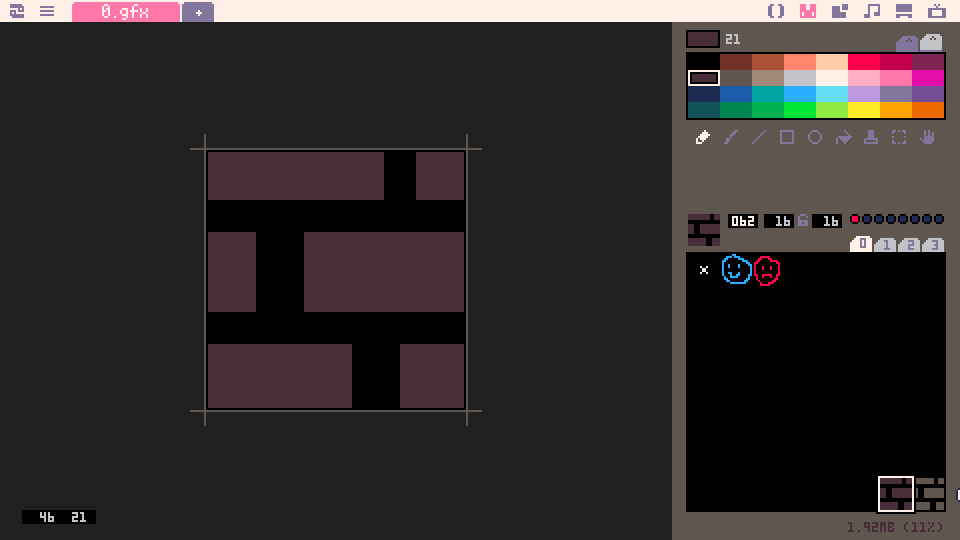
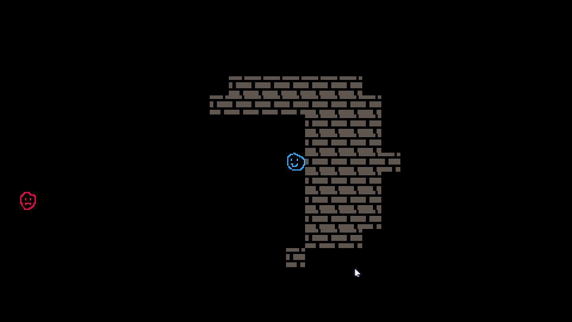
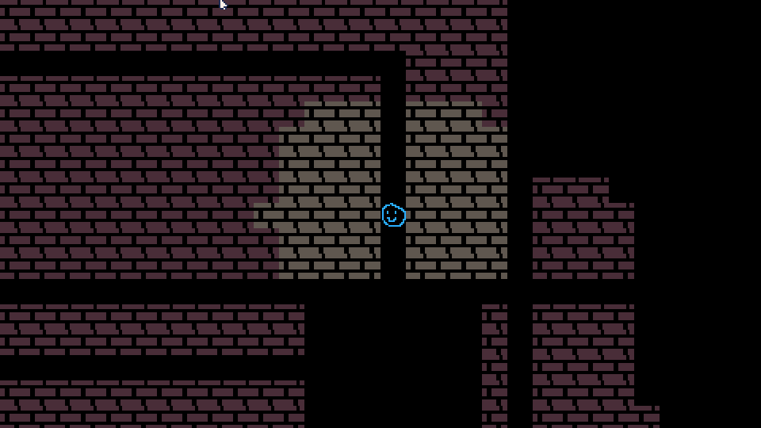

# Part 4: Field of View

In [Part 3](../part-3/part-3.html), we generated a whole dungeon and displayed it on the screen. But that's not really the vide we want in our roguelike, right? Roguelikes are supposed to be about exploring and not knowing what terrible bad guy is right behind the corner! So let's make it so that we only draw what the player can see, or has explored. Let's start by making a new sprite for a wall that we've seen, but can't currently seen.



All I've done here is change the color of the wall sprite to a different darker color. It's not the best, but I think it'll work out ok.

Now, we've been using the Picotron map to store our map, but that doesn't work out so well when you want to hide portions of it. So we're going to modify mapgen.lua to store our information about the base structure of a map in a table, then we'll use that to set our map tiles at draw time.

```lua
-- mapgen.lua

floor = 0
seenWall = 62
wall = 63
mapTiles = {}

...

function populateMap()
	-- generate a random amount of rooms
	local rooms = {}
	for count = 0, maxRooms do
		local width = generateRandomNumber(minSize, maxSize)
		local height = generateRandomNumber(minSize, maxSize)
		local posX = generateRandomNumber(0, mapWidth - width - 1)
		local posY = generateRandomNumber(0, mapHeight - height - 1)
		
		local room = RectRoom:new(posX, posY, width, height)
		local good = true
		-- if the room intersects with another, we're going to toss
		-- it out and keep going
		for otherRoom in all(rooms) do
			if otherRoom:intersects(room) then
				good = false
			end
		end
		if good then
			add(rooms, room)
		end
	end
	-- fill all map tiles with wall, except for tiles that are in a room
	for y = 0, mapHeight do
		for x = 0, mapWidth do
			local tile = wall
			local index = (y * mapWidth) + x
			for room in all(rooms) do
				if room:inRoom(x, y) then
					tile = floor
				end
			end
			mapTiles[index] = tile
		end
	end
	-- tunnel between all rooms
	for index = 1, count(rooms) - 1 do
		local room1 = rooms[index]
		local room2 = rooms[index + 1]
		tunnel = cocreate(tunnelBetween)
		while costatus(tunnel) != "dead" do
			local status, curr = coresume(tunnel, room1, room2)
			if costatus(tunnel) != "dead" then
				local index = (curr.y * mapWidth) + curr.x
				mapTiles[index] = floor
			end
		end
	end
end

```

So now, we're dumping our tile values into `mapTiles` instead of directly writing them to Picotron's map. We're indexing all of our tiles using the simple equation: `(y * mapWidth) + x`. This lets us put all of our tiles into an a single line, essentially. Don't run this yet, you'd get a black screen with your player on it. We've still got a ways to go. Let's make a new file and call it 'fov.lua'.

```lua
-- fov.lua

visible = {}
seen = {}

visionRadius = 5

function updateFOV()
	for y = 0, mapHeight do
		for x = 0, mapWidth do
			local tile = {x=x, y=y}
			local index = (y * mapWidth) + x
			if insideCircle(player, tile, visionRadius) then
				visible[index] = true
				seen[index] = true
			else
				visible[index] = false
			end			
		end
	end
end

function insideCircle(center, tile, radius)
	local dx = center.x - tile.x
	local dy = center.y - tile.y
	local distanceSquared = (dx * dx) + (dy * dy)
	return distanceSquared <= (radius * radius)
end
```

Here, we've got a couple tables that are going to hold whether a tile is visible or seen. Our FOV is simply a circle (the logic for which I've stolen from [Red Blob Games](https://www.redblobgames.com/grids/circle-drawing/)), and essentially, we are omniscient within that five-tile radius. It's not the best way of handling it, but Picotron has no tools built in for that sort of stuff, and I'm sort of lazy and itching to get back to dying in DCSS.

So, now we've got our map generation set up to work in this new way, and we've got our super-complex FOV algorithm, so let's get to stitching it all together. Head over to main.lua.

```lua
-- main.lua

include "utilities.lua"
include "entities.lua"
include "mapgen.lua"
include "fov.lua"

...

function _update()
	if btnp(0) then
		player:move(-1, 0)
	elseif btnp(1) then
		player:move(1, 0)
	elseif btnp(2) then
		player:move(0, -1)
	elseif btnp(3) then
		player:move(0, 1)
	end
	updateFOV()
	updateMap()
end

function updateMap()
	for y = 0, mapHeight do
		for x = 0, mapWidth do
			local tile = floor
			local index = (y * mapWidth) + x
			if mapTiles[index] == wall then
				if visible[index] then
					tile = wall
				elseif seen[index] then
					tile = seenWall
				end
			end
			mset(x, y, tile)
		end
	end
end

...

```

We've modified our `_update` function to finally do something other than handle player input. After the input section, we call off to `updateFOV`, which will take the player's (possibly new) position and figure out what tiles are visible. Then, we call `updateMap` which translates the values in all of our new tables (`mapTiles`, `visible` and `seen`) into what we should be displaying for each tile on the map, and then sets those values in the Picotron map.  Before we run this, there's one last piece that I almost forgot. Let's look at entities.lua:

```lua
-- entities.lua

function findEmptySpot()
	while true do
		local posX = generateRandomNumber(0, mapWidth)
		local posY = generateRandomNumber(0, mapHeight)
		local index = (posY * mapWidth) + posX
		if mapTiles[index] == floor then
			return posX, posY
		end
	end
end
```

We're changing `findEmptySpot` to refer to the `mapTiles` table, because at the time that we call this, the Picotron map is set to all floor tiles, and `isWalkable` still refers to the Picotron map.  With all that handled, let's run this thing.



Looking good.  You might notice something in that clip, or while you're walking around your dungeon. Our NPC isn't really following the rules of our FOV. Makes sense, since we haven't modified any of our draw code to handle that. Let's get to that now, over in main.lua.

```lua
-- main.lua

...

function _draw()
	cls()
	camera(player.x * 16 - 15 * 16, player.y * 16 - 8 * 16)
	map()
	drawEntities()
end

function drawEntities()
	for entity in all(entities) do
		if entity == player or insideCircle(player, entity, visionRadius) then
			entity.draw()
		end
	end
end
```

Not a whole lot new here.  We've moved our entity-drawing logic out of `_draw` and into a new function called `drawEntities`. We do the same loop, but this time for each entity we check to see if it's either the player or in the player's vision circle.  If so, we draw it, if not, we let them stay invisible. Here it is in action:



Everything looks like it's in order! Our dungeon now has the appropriate amount of spooky ambiance we're looking for, with enemies lurking just beyond our torchlight. I'm beat, time for another break. I'll see you again in [Part 5!](../part-5/part-5.html)
