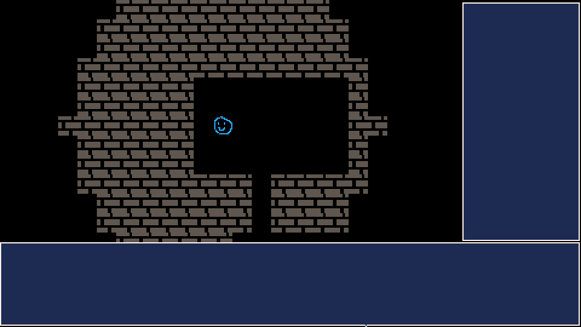
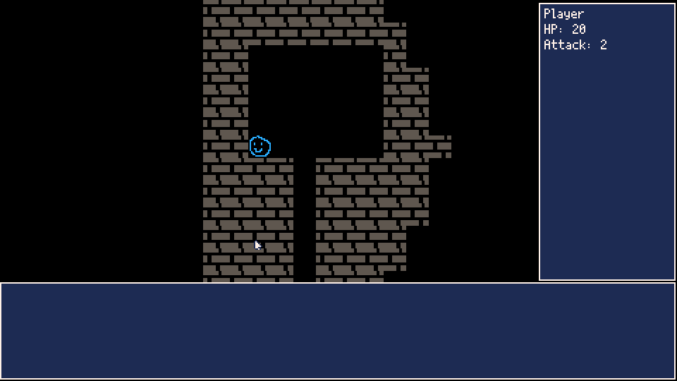
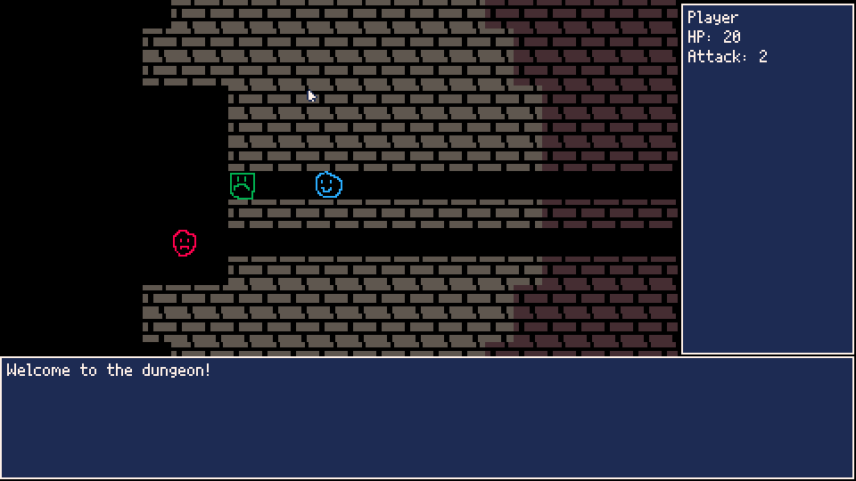
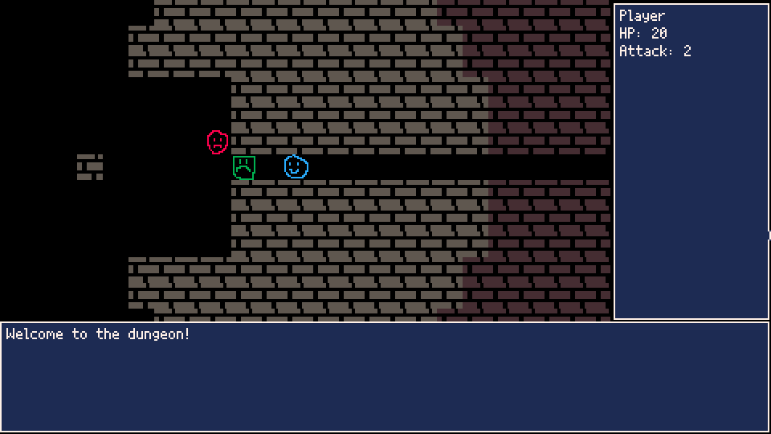
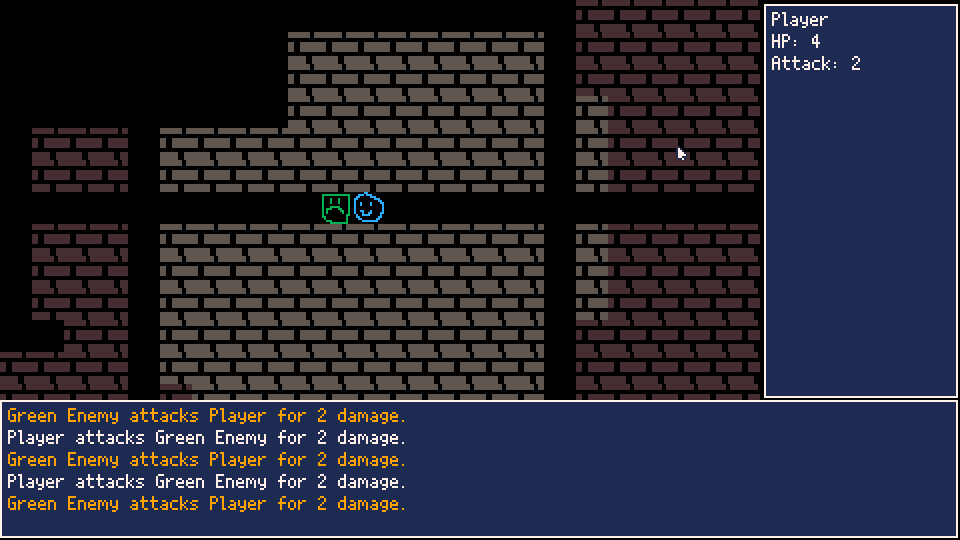
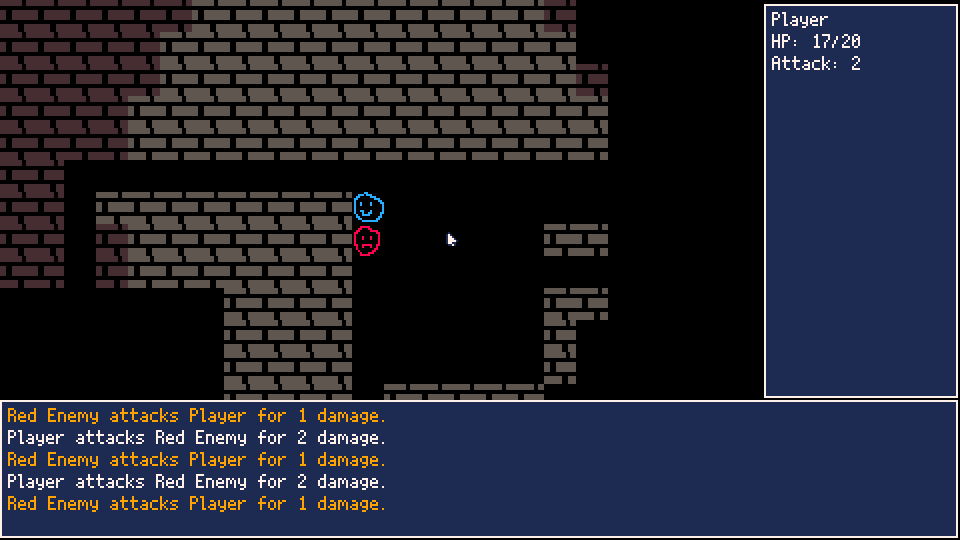
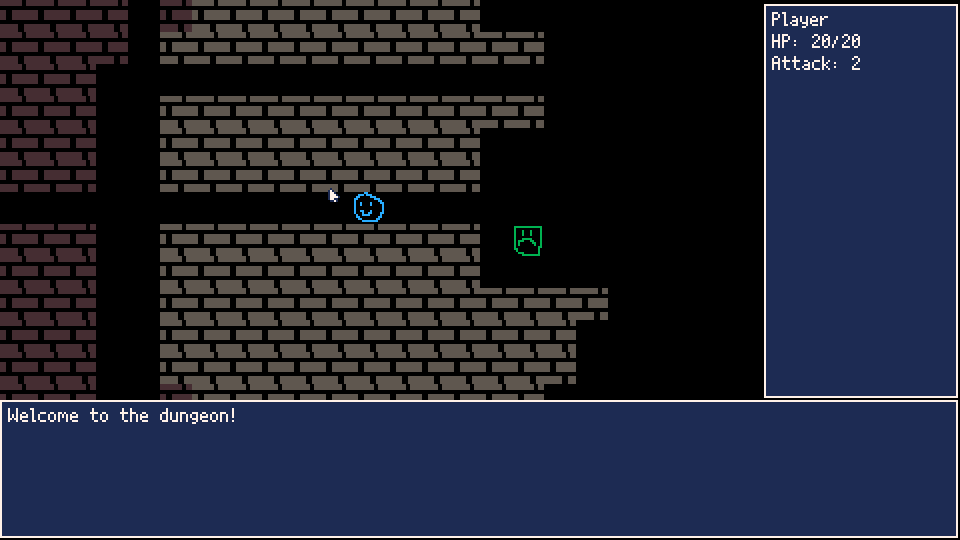

# Part 7 - Building an Interface

Welcome back! In [Part 6](../part-6/part-6.html) we managed to get enemies moving around and finally did some fighting. But a lot of that involved looking at terminal logs using `printh`, and that's not super convenient. It would be great if we could see what was going on inside our game itself. Well, today let's try and figure that out. Let's start out in main.lua.

```lua
-- main.lua

...

function _draw()
	cls()
	clip(0, 0, 380, 200)
	camera(player.x*16 - 11*16, player.y*16 - 6*16)
	map()
	drawEntities()
	drawInterface()
end

function drawInterface()
	clip()
	camera()
	drawSideUI()
	drawBottomUI()
end

function drawSideUI()
	rectfill(382, 2, 478, 198, 1)
	rect(382, 2, 478, 198, 7)
end

function drawBottomUI()
	rectfill(0, 200, 478, 268, 1)
	rect(0, 200, 478, 268, 7)	
end
```
Let's start by making some sections for our information to live. Maybe we'll have a bit on the side for information like player stats, and a bit at the bottom for a message log to see what's going on. To do that, first we change `_draw()` to limit our initial clip area and change our camera position. This limits our map drawing to a 380x200 rectangle, out of our 480x270 screen size. Then after we do all of our usual stuff, we'll call off to a new function `drawInterface()`, which has two helper functions `drawSideUI()` and `drawBottomUI()`. These functions are pretty self explanatory. First, we reset our clipping rectangle and camera, to allow us to reference positions directly on the screen. Then, we draw some blue rectangles with a classy Final Fantasy style white border along the edges.


Looking pretty good so far, but a blue rectangle's useless without some words in there. Let's start with the side UI, since the information for that is readily available in our player object.

```lua
-- main.lua

...

function drawSideUI()
	rectfill(382, 2, 478, 198, 1)
	rect(382, 2, 478, 198, 7)
	cursor(386, 6)
	print(player.name)
	print("HP: " .. player.hp)
	print("Attack: " .. player.attack)
end
```


Well, that certainly does the trick. Now we can see our name, current HP and how much damage we do, with plenty of room for any future stuff we need to plop in there. It's not done in the nicest way, using magic numbers and stuff for our positioning, but there's time for cleaning things up later on. The `cursor()` function is new, it lets us set the position that we start printing text at. after every `print()` function, it jumps down to let us print on the next line for the size of our font. Pretty nice!

For our bottom UI, we're going to need some sort of log handler to let us store all messages and display the most recent ones. We'll put that into a new file called logger.lua.

```lua
-- logger.lua

logs = {}

function log(message)
	add(logs, message)
end

function mostRecentLogs(amount)
	local index = count(logs)
	local recentLogs = {}
	while (amount > 0) do
		if index > 0 then
			add(recentLogs, logs[index])
		end
		amount = amount - 1
		index = index - 1
	end
	return recentLogs
end
```

Real simple, just a table we're dropping strings into, and a function to fetch the most recent few. Back in main.lua, we'll finish up the bottom UI. We'll add a friendly welcome message to the logs on init as well.

```lua
-- main.lua

...

function _init()
	currentState = State.PLAYER_TURN
	populateMap()
	log("Welcome to the dungeon!")
end

...

function drawBottomUI()
logs = {}

function log(message)
	add(logs, message)
end

function mostRecentLogs(amount)
	local index = count(logs)
	local recentLogs = {}
	while (amount > 0) do
		if index > 0 then
			add(recentLogs, logs[index])
		end
		amount = amount - 1
		index = index - 1
	end
	return recentLogs
end
```

And let's pop over to entities.lua for the real meat and potatoes: converting those `printh()` functions to our new `log()` function so that we can see the numbers fly!

```lua
-- entities.lua

...

-- generic melee attack for entity
function Entity:melee(x, y)
	target = getBlockingEntity(x, y)
	if target.combatant and target.hp > 0 then
		target.hp = target.hp - self.attack
		log(self.name .. " attacks " .. target.name .. " for " .. self.attack .. " damage.")
		if target.hp <= 0 then
			log(self.name .. " kills " .. target.name .. "!")
			del(entities, target)
		end
	end
end
```

If you run your game, you should be able to see your logs in all their glory.



Wow, we're cooking with gas now! What more could you want? Well, maybe some color so we can differentiate the log messages a little? We'll make our player's actions white, enemy actions orange, and deaths red. This is really simple, since Picotron lets us just specify color codes inside the text.

```lua
-- entities.lua

...

-- generic melee attack for entity
function Entity:melee(x, y)
	target = getBlockingEntity(x, y)
	if target.combatant and target.hp > 0 then
		target.hp = target.hp - self.attack
		local c = 7
		if self != player then
			c = 9
		end
		log("\f" .. c .. self.name .. " attacks " .. target.name .. " for " .. self.attack .. " damage.\f7")
		if target.hp <= 0 then
			log("\f8" .. self.name .. " kills " .. target.name .. "!\f7")
			del(entities, target)
		end
	end
end
```

I'm not going to make a new GIF of that, but if you run it, you should see glorious color in your logs. What other things should we add? Well, we probably want a new state for the game for after we're killed. This would let us pop up a window saying 'YOU DEAD' or something. While we're talking about states and windows, maybe something where we hit a button and the log history pops up so that we can see more than the last five things that have happened. Let's start with the Game Over state.

```lua
-- main.lua

State = {PLAYER_TURN = "1", ENEMY_TURN = "2", GAME_OVER = "3"}

...

function _update()
	if currentState == State.PLAYER_TURN then
		if player.hp <=0 then
			currentState = State.GAME_OVER
			return
		end
		if btnp(0) then
			player:move(-1, 0)
		elseif btnp(1) then
			player:move(1, 0)
		elseif btnp(2) then
			player:move(0, -1)
		elseif btnp(3) then
			player:move(0, 1)
		end
		updateFOV()
		updateMap()
	elseif currentState == State.ENEMY_TURN then
		updateEntities()
		currentState = State.PLAYER_TURN
	elseif currentState == State.GAME_OVER then
		if btnp(5) then
			currentState = State.PLAYER_TURN
			entities = {}
			populateMap()
			logs = {}
			log("Welcome back to the dungeon!")
		end
	end
end

...

function drawInterface()
	clip()
	camera()
	drawSideUI()
	drawBottomUI()
	drawWindows()
end

function drawWindows()
	if currentState == State.GAME_OVER then
		drawGameOver()
	end
end

function drawGameOver()
	clip()
	camera()
	rectfill(20, 50, 460, 220, 1)
	rect(20, 50, 460, 220, 7)
	cursor(200, 80)
	print("You Died")
	print("Press X to restart")
end

```

So here, on the player's turn, we're checking to see if we've died. If so, we flip to the GAME_OVER state. That causes a big old window to be drawn on the screen, and let's us press X to restart our game. We reinitialize everything when restarting, and toss a cheeky "Welcome back" into the logs.



Now to view the logs. We're going to do something very similar to the Game Over screen, but this time the player is going to have control over opening and closing the window.

```lua
-- main.lua

function _update()
	if currentState == State.PLAYER_TURN then
		if player.hp <=0 then
			currentState = State.GAME_OVER
			return
		end
		if btnp(0) then
			player:move(-1, 0)
		elseif btnp(1) then
			player:move(1, 0)
		elseif btnp(2) then
			player:move(0, -1)
		elseif btnp(3) then
			player:move(0, 1)
		elseif btnp(4) then
			logIndex = 0
			currentState = State.LOG_VIEW
		end
		updateFOV()
		updateMap()
	elseif currentState == State.ENEMY_TURN then
		updateEntities()
		currentState = State.PLAYER_TURN
	elseif currentState == State.GAME_OVER then
		if btnp(5) then
			currentState = State.PLAYER_TURN
			entities = {}
			populateMap()
			logs = {}
			log("Welcome back to the dungeon!")
		end
	elseif currentState == State.LOG_VIEW then
		if btnp(4) then
			currentState = State.PLAYER_TURN
		elseif btnp(2) then
			if logIndex > 0 then
				logIndex = logIndex - 1
			end
		elseif btnp(3) then
			if logIndex < count(logs) then
				logIndex = logIndex + 1
			end
		end
	end
end

...

function drawWindows()
	if currentState == State.GAME_OVER then
		drawGameOver()
	elseif currentState == State.LOG_VIEW then
		drawLogView()
	end
end

function drawLogView()
	clip()
	camera()
	rectfill(20, 50, 460, 220, 1)
	rect(20, 50, 460, 220, 7)
	cursor(24, 54)
	-- starting at logIndex, display 15 messages
	for i=1,15 do
		local currentIndex = logIndex + i
		if currentIndex <= count(logs) then
			print(logs[currentIndex])
		end
	end
end
```

Our `_update()` function's getting a bit long now, but we'll get around to refactoring that sometime later, I'm sure. What we're doing here is checking for `btnp(4)` (the Z button on your keyboard, or the O button on a controller) and if it's pressed, popping up the same size window as the Game Over screen, but we're filling it with 15 log messages. We set up a logIndex variable when we enter it, and pressing up or down increases or decreases the variable, letting us scroll through the logs. Finally, to exit the window, we press the Z button again, and it pops us back into the player turn state. Let's see it in action!



Looks pretty much like I expected it to. Nothing ground breaking here, but we have a nice thing to be able to check our logs, and a good user interface always goes a long way to getting people to play your game. Let's try a couple more things, while I've got you here. Have you noticed that there's no real way to determine what 'fully healthy' looks like for our entities? They've got a hp variable, and that does ok, but when we eventually add a healing item, how will we know not to heal over their max hp value?

```lua
-- entities.lua

...

-- constructor for generic entity
function Entity:new(args)
	local o = setmetatable({}, Entity)
	o.x = args.x
	o.y = args.y
	o.sprite = args.sprite or 0
	o.name = args.name or ""
	o.blocksMovement = args.blocksMovement or false
	o.combatant = args.combatant or false
	o.hp = args.hp or 0
	o.maxHp = args.maxHp or o.hp
	o.attack = args.attack or 0
	return o
end
```

There! A new maxHp variable, and it's initialized to whatever gets passed in as hp on creation, so you don't even need to worry about adding more stuff to your function calls if you don't need it. We'll modify our side UI to show the player's max hp.

```lua
-- main.lua

...

function drawSideUI()
	rectfill(382, 2, 478, 198, 1)
	rect(382, 2, 478, 198, 7)
	cursor(386, 6)
	print(player.name)
	print("HP: " .. player.hp .. "/" .. player.maxHp)
	print("Attack: " .. player.attack)
end
```



Looks perfect. Now we can tell exactly how much damage we've taken. I think the last thing we'll take on today is some way to look around and observe enemies without smacking them. First, let's remove our getBlockingEntity function in entities.lua and replace it with something a little more generic.

```lua
-- entities.lua

...

-- return an entity at the given coords
-- setting onlyBlockers to true only returns blocking entities
function getEntity(x, y, onlyBlockers)
	for entity in all(entities) do
		if entity.x == x and entity.y == y then
			if onlyBlockers then
				if not entity.blocksMovement then
					break
				end
			end
			return entity
		end
	end
end

-- ai function to make entities chase the player
function Entity:ai()
	if player and self != player and self.combatant then
		-- give enemies a fov of 7 tiles
		local start = {x=self.x, y=self.y}
		local goal = {x=player.x, y=player.y}
		if insideCircle(start, goal, 7) then
			path = find_path(start, goal,
                  manhattan_distance,
                  function () return 1 end,
                  map_neighbors,
                  function (node) return node.y * 8 + node.x end,
                  nil)
         if path then
         	local p = path[count(path) - 1]
         	-- do a check to see if a blocking entity that isn't the player
         	-- is there, we don't want our enemies killing each other
         	local e = getEntity(p.x, p.y, true)
         	if e and e != player then
         		return
         	end
         	local dX = p.x - self.x
         	local dY = p.y - self.y
         	self:move(dX, dY)
         end
		end		
	end
end

-- generic move function for entity
function Entity:move(dx, dy)
	local destX = self.x + dx
	local destY = self.y + dy
	if getEntity(destX, destY, true) then
		self:melee(destX, destY)
	elseif isWalkable(destX, destY) then
		self.x = destX
		self.y = destY
	end
	if player then
		currentState = State.ENEMY_TURN
	end
end

-- generic melee attack for entity
function Entity:melee(x, y)
	target = getEntity(x, y, true)
	if target.combatant and target.hp > 0 then
		target.hp = target.hp - self.attack
		local c = 7
		if self != player then
			c = 9
		end
		log("\f" .. c .. self.name .. " attacks " .. target.name .. " for " .. self.attack .. " damage.\f7")
		if target.hp <= 0 then
			log("\f8" .. self.name .. " kills " .. target.name .. "!\f7")
			del(entities, target)
		end
	end
end
```

We've created a new `getEntity()` function, and replaced all references to our `getBlockingEntity()` function with it. Why did we do this? Well, they're basically the same thing, we just have an extra little check to see if something blocked movement, but this gives us much more freedom when it comes to examining something. If we have a more generic function to find entities at a given coordinate, we can look at things that wouldn't necessarily block our movement, like a healing potion or a sword. This gives us a lot, and still provides the same functionality the old function was giving us. If you want to find a blocking entity, just pop `true` in for the onlyBlockers parameter, and it will provide the exact same functionality. Now, let's go to main.lua and get to the meat and potatoes of our examine mode.

```lua
-- main.lua

State = {PLAYER_TURN = "1", ENEMY_TURN = "2", GAME_OVER = "3",
	LOG_VIEW = "4", EXAMINE = "5"}

...

function _update()
	if currentState == State.PLAYER_TURN then
		if player.hp <=0 then
			currentState = State.GAME_OVER
			return
		end
		if btnp(0) then
			player:move(-1, 0)
		elseif btnp(1) then
			player:move(1, 0)
		elseif btnp(2) then
			player:move(0, -1)
		elseif btnp(3) then
			player:move(0, 1)
		elseif btnp(4) then
			logIndex = 0
			currentState = State.LOG_VIEW
		elseif btnp(5) then
			examineCursor = {x=player.x, y=player.y}
			currentState = State.EXAMINE
		end
		updateFOV()
		updateMap()
	elseif currentState == State.ENEMY_TURN then
		updateEntities()
		currentState = State.PLAYER_TURN
	elseif currentState == State.GAME_OVER then
		if btnp(5) then
			currentState = State.PLAYER_TURN
			entities = {}
			populateMap()
			logs = {}
			log("Welcome back to the dungeon!")
		end
	elseif currentState == State.LOG_VIEW then
		if btnp(4) then
			currentState = State.PLAYER_TURN
		elseif btnp(2) then
			if logIndex > 0 then
				logIndex = logIndex - 1
			end
		elseif btnp(3) then
			if logIndex < count(logs) then
				logIndex = logIndex + 1
			end
		end
	elseif currentState == State.EXAMINE then
		if btnp(5) then
			currentState = State.PLAYER_TURN
		elseif btnp(0) then
			examineCursor.x = examineCursor.x - 1
		elseif btnp(1) then
			examineCursor.x = examineCursor.x + 1
		elseif btnp(2) then
			examineCursor.y = examineCursor.y - 1
		elseif btnp(3) then
			examineCursor.y = examineCursor.y + 1
		end
	end
end

...

function _draw()
	cls()
	clip(0, 0, 380, 200)
	camera(player.x*16 - 11*16, player.y*16 - 6*16)
	map()
	drawEntities()
	if currentState == State.EXAMINE then
		-- draw a white square around the tile at the cursor
		rect(examineCursor.x * 16, examineCursor.y * 16,
			(examineCursor.x + 1) * 16, (examineCursor.y + 1) * 16, 7)
		-- look for entities at the examine cursor
		local target = getEntity(examineCursor.x, examineCursor.y)
		if target then
			print(target.name, (examineCursor.x + 1.5) * 16, (examineCursor.y + 0.25) * 16)
		end
	end
	drawInterface()
end
```

So what's going on here? We added a new examine state that we can enter by pressing X on our keyboard (`btnp(5)`). This sets a variable called examineCursor to our player's position, and highlights the tile specified with a white rectangle. we can move it around using the arrow keys, and when we get to a tile with something in it, it'll print the name off to the side. We can then exit this mode by pressing X again. Let's see it in action.



We've added so much this time around, you should be proud of yourself. I'm certainly proud of you, and I'm proud of me too. I'm basically half way through writing this thing! Let's give it a break for today. As always, you can try out the game [here](./p7-roguelike.html). See you in [Part 8](../part-8/part-8.html)!

## Addendum: A Bug in Plain Sight

You might have run into a bit of a problem while moving around. Occasionally we end up with an 'out of memory' error. This seems to happen whenever an enemy can see you through a wall, and I'm guessing that it's because the pathfinding algorithm gets too large and ends up chewing through all our memory. This probably wouldn't be an issue if we were just running on any old computer, but we're making a Picotron game, and there's limitations on memory usage. To get around this, we need to limit the field of view to just what is visible. How can we do that? By drawing a line from one point to another and seeing if we're obstructed. Head on over to old fov.lua.

```lua
-- fov.lua

function updateFOV()
	for y = 0, mapHeight do
		for x = 0, mapWidth do
			local tile = {x=x, y=y}
			local index = (y * mapWidth) + x
			if insideCircle(player, tile, visionRadius) then
				if isVisible(player, tile) then
					visible[index] = true
					seen[index] = true
				else
					visible[index] = false
				end
			else
				visible[index] = false
			end			
		end
	end
end

-- bresenham algorithm taken from https://github.com/rm-code/bresenham
function isVisible(src, dest)
	local dx = abs(dest.x - src.x)
	local dy = abs(dest.y - src.y) * -1
	local sx = src.x < dest.x and 1 or -1
	local sy = src.y < dest.y and 1 or -1
	local err = dx + dy
	
	local x = src.x
	local y = src.y
	while true do
		if x == dest.x and y == dest.y then
			return true
		end
		if not isWalkable(x, y) then
			return false
		end
		local tmpErr = 2 * err
		if tmpErr > dy then
			err = err + dy
			x = x + sx
		end
		if tmpErr < dx then
			err = err + dx
			y = y + sy
		end
	end
end
```

The Bresenham algorithm is a pretty simple way to draw lines on a grid. I'm not going to go through the math here, but it does the job. You can see that we've modified our `updateFOV()` function to check if a tile is visible if it's inside our vision radius. This will make our line of sight stop at tiles that aren't walkable. We may need to change this in the future if we add tiles that aren't walkable but are transparent, like windows, but for now, it's ok. Now let's hop over to entities.lua and change our problematic enemy vision to use this new function.

```lua
-- entities.lua

-- ai function to make entities chase the player
function Entity:ai()
	if player and self != player and self.combatant then
		-- give enemies a fov of 7 tiles
		local start = {x=self.x, y=self.y}
		local goal = {x=player.x, y=player.y}
		if insideCircle(start, goal, 7) and isVisible(start, goal) then
			path = find_path(start, goal,
				 manhattan_distance,
				 function () return 1 end,
				 map_neighbors,
				 function (node) return node.y * 8 + node.x end,
				 nil)
			if path then
				local p = path[count(path) - 1]
				-- do a check to see if a blocking entity that isn't the player
				-- is there, we don't want our enemies killing each other
				local e = getEntity(p.x, p.y, true)
				if e and e != player then
					return
				end
				local dX = p.x - self.x
				local dY = p.y - self.y
				self:move(dX, dY)
			end
		end		
	end
end
```

There you go. Now our enemies should only be able to try to walk to us if they have unobstructed line of sight. This isn't perfect. You'll notice that you can duck behind corners to dodge enemies, and some of the wall drawing looks a little weird. But, I suppose it's better than crashing our game. If you're an expert, feel free to submit a pull request telling me how to make this better!
