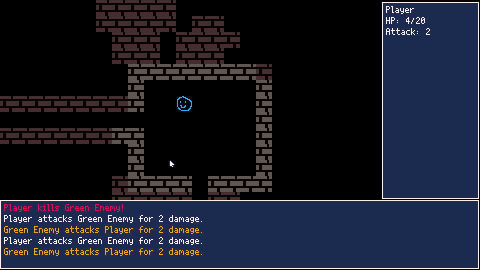

# Items and Inventory

In [Part 7](../part-7/part-7.html), we made the beginnings of our user interface, which lets us see all sorts of things. But why are we in the dungeon to begin with? Sure, beating up bad guys is its own reward, but what we really want is the shiny, shiny loot. So today, we're going to start working on making some cool items and a big old sack for you to store them in. Let's start with those classics of dungeons, the healing potion. Pop over to the sprite editor and make your best bottle, and fill it with the reddest liquid possible. We all know healing is red.

![[p8-health_potion.png]]

Hey, maybe I'm getting better at this! That's a pretty good potion. Hopefully yours looks great too. Now all we have to do is plop them around the dungeon. Off to mapgen.lua!

```lua
-- mapgen.lua
maxItemsPerRoom = 1

...


-- generate a random map
function populateMap()
	-- generate a random amount of rooms
	local rooms = {}
	for count = 0, maxRooms do
		local width = generateRandomNumber(minSize, maxSize)
		local height = generateRandomNumber(minSize, maxSize)
		local posX = generateRandomNumber(0, mapWidth - width - 1)
		local posY = generateRandomNumber(0, mapHeight - height - 1)
		
		local room = RectRoom:new(posX, posY, width, height)
		local good = true
		-- if the room intersects with another, we're going to toss
		-- it out and keep going
		for otherRoom in all(rooms) do
			if otherRoom:intersects(room) then
				good = false
			end
		end
		if good then
			add(rooms, room)
			-- place player in the first room, enemies can be in any of the others
			if count == 0 then
				local x = generateRandomNumber(posX+1, posX + width)
				local y = generateRandomNumber(posY+1, posY + height)
				placePlayer(x, y)
			else
				-- use this instead of generateRandomNumber function because it is inclusive
				local enemyCount = flr(rnd(maxEnemiesPerRoom + 1))
				while (enemyCount > 0) do
					local x = generateRandomNumber(posX+1, posX + width)
					local y = generateRandomNumber(posY+1, posY + height)
					placeEnemy(x, y)		
					enemyCount = enemyCount - 1
				end
				
				local itemCount = flr(rnd(maxItemsPerRoom + 1))
				while (itemCount > 0) do
					local x = generateRandomNumber(posX+1, posX + width)
					local y = generateRandomNumber(posY+1, posY + height)
					placeItem(x, y)
					itemCount = itemCount - 1
				end
			end
		end
	end
	-- fill all map tiles with wall, except for tiles that are in a room
	for y = 0, mapHeight do
		for x = 0, mapWidth do
			local tile = wall
			local index = (y * mapWidth) + x
			for room in all(rooms) do
				if room:inRoom(x, y) then
					tile = floor
				end
			end
			mapTiles[index] = tile
		end
	end
	-- tunnel between all rooms
	for index = 1, count(rooms) - 1 do
		local room1 = rooms[index]
		local room2 = rooms[index + 1]
		tunnel = cocreate(tunnelBetween)
		while costatus(tunnel) != "dead" do
			local status, curr = coresume(tunnel, room1, room2)
			if costatus(tunnel) != "dead" then
				local index = (curr.y * mapWidth) + curr.x
				mapTiles[index] = floor
			end
		end
	end
end

function placeItem(x, y)
	if getEntity(x, y) then
		return
	end
	local item = Entity:new({x=x, y=y, sprite=8, name="Healing Potion"})
	add(entities, item)
end
```

So, we're basically copying the enemy spawning logic, but for items. Right now we only have the one item, so the `placeItem()` function is pretty simple. I've replaced the loop through all entities with a call to `getEntity()`, you can do that in `placeEnemy()` as well, if you're feeling up to it. Let's see it in action!


There it is, our healing potion, in all its glory. But what good is a potion if we can't pick it up and chug it? We need to make an inventory. Head on over to entities.lua.

```lua
-- entities.lua

-- constructor for generic entity
function Entity:new(args)
	local o = setmetatable({}, Entity)
	o.x = args.x
	o.y = args.y
	o.sprite = args.sprite or 0
	o.name = args.name or ""
	o.blocksMovement = args.blocksMovement or false
	o.combatant = args.combatant or false
	o.hp = args.hp or 0
	o.maxHp = args.maxHp or o.hp
	o.attack = args.attack or 0
	o.inventory = args.inventory or {}
	o.consumable = args.consumable or false
	return o
end

-- add a given entity to the player's inventory
function Entity:pickUp(target)
	if self == player then
		if not target.combatant then
			-- add to inventory
			add(self.inventory, target)
			log("\f7" .. self.name .. " picks up a " .. target.name)
			-- remove from global entities list
			del(entities, target)
		end
	end
end

...

-- return item at the given coords
function getItem(x, y)
	for entity in all(entities) do
		if entity.x == x and entity.y == y then
			if not entity.combatant then
				return entity
			end
		end
	end
end
```

Here, we've added a couple items to our generic Entity. First, a table for its inventory. For everyone except the player, it's going to be empty, but there's nothing stopping an enemy from having a potion in its bag.  We also add a flag to tell us if something is consumable or not, because you generally don't want an infinite use health potion (unless you do, it's your game!). There's a couple new functions: `Entity:pickUp()` and `getItem()`. `getItem()` is extremely similar to `getEntity()`, except it specifically filters out anything that has the combatant flag, giving us only items. Finally `Entity:pickUp()` let's the player grab items and add them to the inventory table, removing them from the global entities table (which makes it disappear from the screen). There's a couple more things we need to add before trying it out. First, let's go to mapgen.lua and modify our healing potion to have the consumable flag.

```lua
-- mapgen.lua

...

function placeItem(x, y)
	if getEntity(x, y) then
		return
	end
	local item = Entity:new({x=x, y=y, sprite=8, name="Healing Potion", consumable=true})
	add(entities, item)
end

```

That's not completely necessary right now, since we're not working on using the potion yet, but it'll be needed in the future. Then we're going to head on over to main.lua and make some modifications to let us pick it up. Right now, we're just going to use the button (button 4, or Z on the keyboard) we use for log view, just for testing.

```lua
-- main.lua

...

function _update()
	if currentState == State.PLAYER_TURN then
		if player.hp <=0 then
			currentState = State.GAME_OVER
			return
		end
		if btnp(0) then
			player:move(-1, 0)
		elseif btnp(1) then
			player:move(1, 0)
		elseif btnp(2) then
			player:move(0, -1)
		elseif btnp(3) then
			player:move(0, 1)
		elseif btnp(4) then
--			logIndex = 0
--			currentState = State.LOG_VIEW
			local item = getItem(player.x, player.y)
			if item then
				player:pickUp(item)
			end
		elseif btnp(5) then
			examineCursor = {x=player.x, y=player.y}
			currentState = State.EXAMINE
		end
		updateFOV()
		updateMap()
	elseif currentState == State.ENEMY_TURN then
		updateEntities()
		currentState = State.PLAYER_TURN
	elseif currentState == State.GAME_OVER then
		if btnp(5) then
			currentState = State.PLAYER_TURN
			entities = {}
			populateMap()
			logs = {}
			log("Welcome back to the dungeon!")
		end
	elseif currentState == State.LOG_VIEW then
		if btnp(4) then
			currentState = State.PLAYER_TURN
		elseif btnp(2) then
			if logIndex > 0 then
				logIndex = logIndex - 1
			end
		elseif btnp(3) then
			if logIndex < count(logs) then
				logIndex = logIndex + 1
			end
		end
	elseif currentState == State.EXAMINE then
		if btnp(5) then
			currentState = State.PLAYER_TURN
		elseif btnp(0) then
			examineCursor.x = examineCursor.x - 1
		elseif btnp(1) then
			examineCursor.x = examineCursor.x + 1
		elseif btnp(2) then
			examineCursor.y = examineCursor.y - 1
		elseif btnp(3) then
			examineCursor.y = examineCursor.y + 1
		end
	end
end
```

You can see we've commented out what we had when we press button 4 on the player's turn, and replaced it with picking up an item. Let's give it a go real fast.


It works, but we've got a pretty big problem: we had to get rid of the button to enter log view to be able to do it. If we were making a roguelike using some other framework, we'd just map all these things to different buttons on the keyboard. While you can do that in Picotron, it's really more of a controller-centric system. So, let's come up with a way to handle these things with less buttons. 

Things that we want front and center, like picking up items and looking at the world, should probably be easily accessible with buttons, while the rest of the stuff can be tucked away in some sort of menu, just like you'd do in a traditional JRPG or something. I'm going to stick to the following button conventions from here on out:
- **Buttons 0-3** - Directional buttons. Used for moving the character, and navigating through menus.
- **Button 4** - Z on the keyboard, O on a controller. Used for picking up items, or for selecting something in a menu
- **Button 5** - X on the keyboard, X on a controller. Used for exiting out of menus, or for entering examine mode.
- **Button 6** - Enter on the keyboard, Start on a controller. Used for entering the menu screen.
I think with this, we can pretty much handle everything we need to do. We're departing a bit from traditional roguelikes a bit, since one of the core pieces there is that you should be able to do most things without navigating through menus, but working within limitations is part of the fun of Picotron!

>**Note:** I know that Picotron technically accepts more controller buttons as well. It gives us two sets of directional input, four face buttons, two shoulder buttons and the menu button. I'm choosing to ignore some of this because I feel that if we're working with keyboard, it's a little uncomfortable to use. I want this to be playable both on controller and keyboard, and I feel this is the best way to go about it.

Now that we have an idea of how we want our final control scheme, let's go about implementing things! We're going to make a lot of changes in main.lua.

```lua
-- main.lua
State = {PLAYER_TURN=1, ENEMY_TURN=2, GAME_OVER=3,
	EXAMINE=4, MENU=5, INVENTORY=6, LOG_VIEW=7}
window{
	pauseable = false
}
menuItems = {"Inventory", "Logs"}


...

function _update()
	if currentState == State.PLAYER_TURN then
		updatePlayerTurn()
	elseif currentState == State.ENEMY_TURN then
		updateEntities()
		currentState = State.PLAYER_TURN
	elseif currentState == State.GAME_OVER then
		updateGameOver()
	elseif currentState == State.LOG_VIEW then
		updateLogView()
	elseif currentState == State.EXAMINE then
		updateExamine()
	elseif currentState == State.MENU then
		updateMenu()
	elseif currentState == State.INVENTORY then
		updateInventory()
	end
end

function updatePlayerTurn()
	if player.hp <=0 then
		currentState = State.GAME_OVER
		return
	end
	if btnp(0) then
		player:move(-1, 0)
	elseif btnp(1) then
		player:move(1, 0)
	elseif btnp(2) then
		player:move(0, -1)
	elseif btnp(3) then
		player:move(0, 1)
	elseif btnp(4) then
		local item = getItem(player.x, player.y)
		if item then
			player:pickUp(item)
		end
	elseif btnp(5) then
		examineCursor = {x=player.x, y=player.y}
		currentState = State.EXAMINE
	elseif btnp(6) then
		menuSelection = 1
		currentState = State.MENU
	end
	updateFOV()
	updateMap()
end

function updateGameOver()
	if btnp(5) then
		currentState = State.PLAYER_TURN
		entities = {}
		populateMap()
		logs = {}
		log("Welcome back to the dungeon!")
	end
end

function updateMenu()
	if btnp(2) then
		if menuSelection > 1 then
			menuSelection = menuSelection - 1
		end
	elseif btnp(3) then
		if menuSelection < count(menuItems) then
			menuSelection = menuSelection + 1
		end
	elseif btnp(4) then
		local value = State.MENU + menuSelection
		currentState = State[fetchState(value)]
		logIndex = 0
		inventoryIndex = 0
	elseif btnp(5) or btnp(6) then
		currentState = State.PLAYER_TURN
	end
end

function fetchState(value)
	for k,v in pairs(State) do
		if v == value then
			return k
		end
	end
end

function updateExamine()
	if btnp(5) then
		currentState = State.PLAYER_TURN
	elseif btnp(0) then
		examineCursor.x = examineCursor.x - 1
	elseif btnp(1) then
		examineCursor.x = examineCursor.x + 1
	elseif btnp(2) then
		examineCursor.y = examineCursor.y - 1
	elseif btnp(3) then
		examineCursor.y = examineCursor.y + 1
	end
end

function updateLogView()
	if btnp(5) then
		currentState = State.PLAYER_TURN
	elseif btnp(2) then
		if logIndex > 0 then
			logIndex = logIndex - 1
		end
	elseif btnp(3) then
		if logIndex < count(logs) then
			logIndex = logIndex + 1
		end
	end
end

function updateInventory()
	if btnp(5) then
		currentState = State.PLAYER_TURN
	elseif btnp(2) then
		if inventoryIndex > 0 then
			inventoryIndex = inventoryIndex - 1
		end
	elseif btnp(3) then
		if inventoryIndex < count(player.inventory) then
			inventoryIndex = inventoryIndex + 1
		end
	elseif btnp(4) then
		-- use item
	end
end

...

function drawSideUI()
	drawWindow(382, 2, 478, 198)
	cursor(386, 6)
	print(player.name)
	print("HP: " .. player.hp .. "/" .. player.maxHp)
	print("Attack: " .. player.attack)
end

function drawBottomUI()
	drawWindow(0, 200, 478, 268)
	cursor(4, 204)
	local logData = mostRecentLogs(5)
	for log in all(logData) do
		print(log)
	end
end

function drawWindows()
	if currentState == State.GAME_OVER then
		drawGameOver()
	elseif currentState == State.LOG_VIEW then
		drawLogView()
	elseif currentState == State.MENU then
		drawMenu()
	elseif currentState == State.INVENTORY then
		drawInventory()
	end
end

function drawWindow(sx, sy, dx, dy, title)
	rectfill(sx, sy, dx, dy, 1)
	rect(sx, sy, dx, dy, 7)
	if title then
		local windowMiddle = sx + ((dx - sx) / 2)
		local len = 	print(" " .. title .. " ", 0, -200)
		local titleX = windowMiddle - len / 2
		print("\#1 " .. title .. " ", titleX, sy-2, 7)
	end
end

function drawGameOver()
	drawWindow(20, 50, 460, 220, "Game Over")
	cursor(200, 80)
	print("You Died")
	print("Press X to restart")
end

function drawLogView()
	drawWindow(20, 50, 460, 220, "Logs")
	cursor(28, 58)
	-- starting at logIndex, display 15 messages
	for i=1,15 do
		local currentIndex = logIndex + i
		if currentIndex <= count(logs) then
			print(logs[currentIndex])
		end
	end
end

function drawMenu()
	drawWindow(100, 50, 360, 220, "Menu")
	cursor(108, 58)
	for item = 1, count(menuItems) do
		local textColor = 7
		if menuSelection == item then
			textColor = 8
		end
		print("\f" .. textColor .. menuItems[item])
	end
end

function drawInventory()
	drawWindow(20, 50, 460, 220, "Inventory")
	cursor(28, 58)
	if count(player.inventory) > 0 then
		for i = 1, count(player.inventory) do
			print(player.inventory[i].name)
		end
	end
end
```

Oh my goodness! That's so much stuff. Good on you for looking at it. Let's step through what we did a piece at a time.
- We modified our State table. Changing the strings over to numbers facilitates a little trick we're going to do later. Also, we've swapped some things around, also to make this trick work.
- Adding the `window` call at the beginning of the program lets us modify some of the behind-the-scenes properties of a Picotron program. For instance, setting `pauseable=false` disables the default behavior of the Menu button (Enter on the keyboard), allowing us to use that button for our own purposes. Helpful!
- The `menuItems` table will list all of our entries in the main menu, which we'll see later.
- Look at that refactor for the `_update()` function! We've been talking about it for a while, and here it is. Everything is so much cleaner in that function, but now we've got a ton more functions. Everything in its right place though.
- In `updatePlayerTurn()`, we've added the button handler for the Menu button. This sets a variable to track what we're selecting in the main menu (`menuSelection`)
- We have the main menu update function: `updateMenu()`. It lets you change your menu selection by pressing up or down, select something using O (or Z on the keyboard) and exit out by pressing X. The trick we were talking about earlier happens in the selection code. We add the value of `State.MENU` to our selection index, and then grab the state key associated with that value (in `fetchState()`). This relies on our States being in a certain order, and that order matching the items in menuItems. As long as we keep that stuff nice and clean, it works like a charm!
- In `updateInventory()` we handle the logic for navigating our inventory. I haven't added anything about selecting the item yet, because we haven't started working on item logic yet, but it's coming, don't worry!
- We've made a new generic function for drawing interface windows: `drawWindow()`. It'll do the basic Final Fantasy-style blue window, white border that we've been using for everything. In addition, you can pass a window title in, and it'll center it on the top of the window, so we don't get confused when navigating menus. (Note the `\#` we add to the window title string, that lets us specify background color, just like `\f` lets us specify text color. This is so we can make a gap in the border so the text is clearly visible.)
- We've got new draw functions, `drawMenu()` and `drawInventory()`. They do exactly what you think they do. Note that we're dealing with how to display currently selected items by changing their text color to red. I feel like maybe shading a rectangle behind the selection might be nicer, but I am so lazy.

Whew! Let's take a look at all this in action!


So what's left? Surely we're done, right? Not quite. We still need to be able to use an item, and we need to be able to get rid of items we don't want. Let's head back in to entities.lua.

```lua
-- entities.lua

...

-- constructor for generic entity
function Entity:new(args)
	local o = setmetatable({}, Entity)
	o.x = args.x
	o.y = args.y
	o.sprite = args.sprite or 0
	o.name = args.name or ""
	o.blocksMovement = args.blocksMovement or false
	o.combatant = args.combatant or false
	o.hp = args.hp or 0
	o.maxHp = args.maxHp or o.hp
	o.attack = args.attack or 0
	o.healing = args.healing or 0
	o.inventory = args.inventory or {}
	o.consumable = args.consumable or false
	o.activationFunction = args.activationFunction or nil
	return o
end

...

-- generic function for using an item
function Entity:use(item)
	if item.activationFunction then
		item.activationFunction(self, item)
		log("\f7" .. self.name .. " uses " .. item.name)
		if item.consumable then
			del(self.inventory, item)
		end
	end
end

-- function for dropping an item
function Entity:drop(target)
	-- set coordinates of the item to the coordinates of the entity dropping it
	target.x = self.x
	target.y = self.y
	-- add item to global entities list
	add(entities, target)
	-- remove from inventory
	del(self.inventory, target)
	log("\f7" .. self.name .. " drops " .. target.name)
end

...

-- function for healing items
function heal(user, item)
	if item.healing > 0 then
		local healed = user.hp + item.healing
		if healed > user.maxHp then
			healed = user.maxHp
		end
		printh(user.name .. " heals for " .. item.healing)
		log("\f3" .. user.name .. " heals for " .. item.healing .. " HP!")
		user.hp = healed
	end
end
```

So, we've added some variables to our base Entity. First, we add a healing value. It'll only be used by healing items, but it's better than doing something like negative attack. Then, we add an activationFunction variable, which holds a function to be called when the item is used. This will let us have a ton of different features without having to have a lot of weird stuff inside the Entity. Later on down the file, we make `Entity:use()` (and `Entity:drop()`, though we're not going to handle that yet). They do what you expect: If you're using an item, you call the activation function. If the item is consumable, it disappears after you use it. Finally, we define a `heal()` function, which adds the item's healing value to the user's current hp. Next, we'll pop over to main.lua.

```lua
-- main.lua

...

function updateInventory()
	if btnp(5) then
		currentState = State.PLAYER_TURN
	elseif btnp(2) then
		if inventoryIndex > 1 then
			inventoryIndex = inventoryIndex - 1
		end
	elseif btnp(3) then
		if inventoryIndex < count(player.inventory) then
			inventoryIndex = inventoryIndex + 1
		end
	elseif btnp(4) then
		-- use item
		player:use(player.inventory[inventoryIndex])
	end
end
```

Pretty simple. We've just added a call to the `Entity:use()` function when pressing O, which will let us kick off the item usage process. Finally, let's head over to mapgen.lua to modify the instantiation of our healing potions to make sure they do the stuff we expect.

```lua
-- mapgen.lua

...

function placeItem(x, y)
	if getEntity(x, y) then
		return
	end
	local item = Entity:new({x=x, y=y, sprite=8, name="Healing Potion",
		consumable=true, healing=4, activationFunction=heal})
	add(entities, item)
end
```

We've just added the healing argument to the potion's constructor, and provided a reference to the `heal()` function for our item's activation. Let's give it a try.


Hooray! We selected the potion, used it, and it appropriately disappeared from our inventory. Everything's working as expected so far. There's only one problem: How can we drop our item? As of right now, all the buttons we're using are used up! We're going to need to have a context menu to give us additional options when we select an item. Back into main.lua once again.

```lua
-- main.lua

...

context = false
ItemState = {USE="Use", DROP="Drop"}

...

function updateInventory()
	if context then
		if btnp(5) then
			context = false
		elseif btnp(2) then
			if contextIndex > 1 then
				contextIndex = contextIndex - 1
			end
		elseif btnp(3) then
			if contextIndex < count(contextItems) then
				contextIndex = contextIndex + 1
			end
		elseif btnp(4) then
			local value = contextItems[contextIndex]
			if value == ItemState.USE then
				-- use item
				player:use(contextTarget)
			elseif value == ItemState.DROP then
				-- drop item
				player:drop(contextTarget)
			end
			context = false
		end
	else
		if btnp(5) then
			currentState = State.PLAYER_TURN
		elseif btnp(2) then
			if inventoryIndex > 1 then
				inventoryIndex = inventoryIndex - 1
			end
		elseif btnp(3) then
			if inventoryIndex < count(player.inventory) then
				inventoryIndex = inventoryIndex + 1
			end
		elseif btnp(4) then
			-- open context menu for item
			context = true
			contextIndex = 1
			contextItems = {}
			contextTarget = player.inventory[inventoryIndex]
			if contextTarget.consumable then
				add(contextItems, ItemState.USE)
			end
			add(contextItems, ItemState.DROP)
		end
	end
end

...

function drawInventory()
	drawWindow(20, 50, 460, 220, "Inventory")
	cursor(28, 58)
	if count(player.inventory) > 0 then
		for i = 1, count(player.inventory) do
			local textColor = 7
			if inventoryIndex == i then
				textColor = 8
			end
			print("\f" .. textColor .. player.inventory[i].name)
		end
	end
	if context then
		drawWindow(100, 100, 360, 200, contextTarget.name)
		cursor(108, 108)
		for i = 1, count(contextItems) do
			local textColor = 7
			if contextIndex == i then
				textColor = 8
			end
			print("\f" .. textColor .. contextItems[i])
		end
	end
end
```

As you can see we added a new context flag, and some additional item-specific states that'll only be used when we're in an inventory context menu. Then, in the `updateInventory()` function, we do all the hard work. We change the current logic to only be run if the context flag is false, and we have it set the context flag when we press O on an item. Based on the item's properties, we add items to the contextItems table, which will determine what is displayed to the user. For instance, if an item is consumable, we want to add 'Use', but we probably wouldn't want that for a sword. Everything should be droppable though, so that one is outside the logic. Then back up to the situation if the context flag is true. You should recognize some of the logic here, because it's mostly the same as every other menu we've made. The only trick here is that we grab the selection we've made from contextItems and use that to determine what function we're going to call when we press O.

Finally, we have the `drawInventory()` function, where we're just tacking on the extra drawing logic for the context menu at the end. Again, it should look pretty much like all the menus we've made. That `drawWindow()` helper is really coming in clutch, isn't it? Let's see it all in action.



Hey, look at that! The context menu opens up perfectly, the drop function works great, and using an item is still as easy as ever. Well, let me tell you, I am exhausted. I'm sure you are too, this was a lot. Proud of you for sticking with it. Let's take a well-deserved break. Once again, you can play the current version [here](./p8-roguelike.html). I'll see you in [Part 9](../part-9/part-9.html)!
